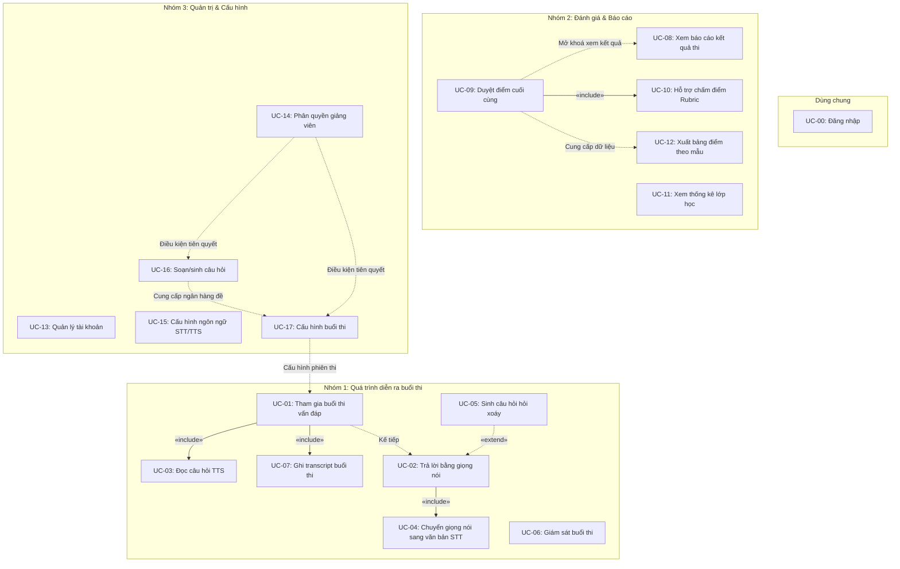
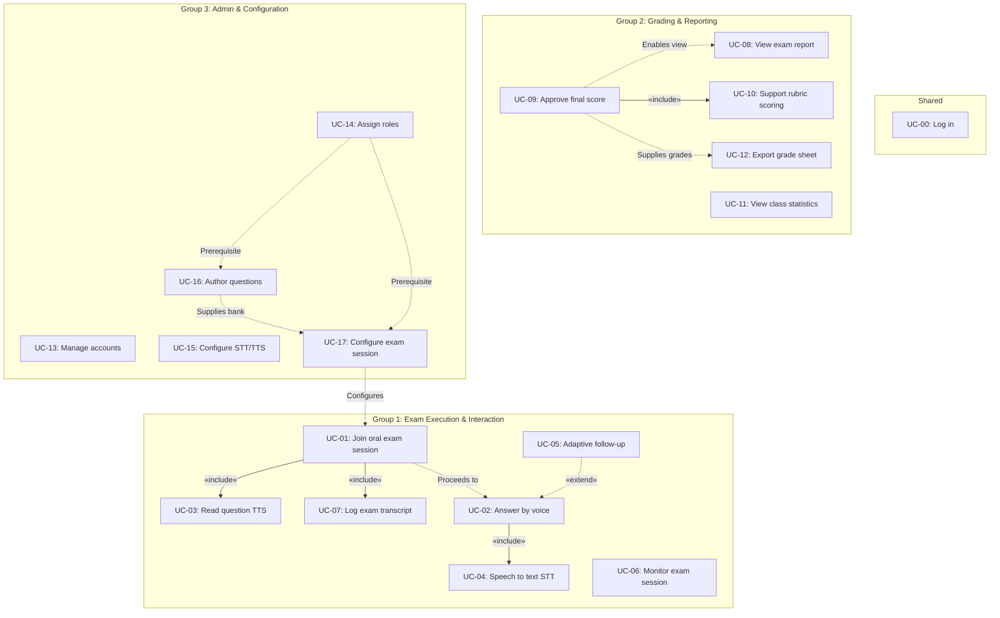

# 📚 TÀI LIỆU ĐẶC TẢ USE CASE — HỆ THỐNG AIVES
### *(AI-powered Viva Exam System — Use Case Specification)*

---

## 📌 Điều hướng nhanh / Quick Navigation

- 🇻🇳 **[PHẦN I: ĐẶC TẢ USE CASE (TIẾNG VIỆT)](#phần-i-đặc-tả-use-case-tiếng-việt)**
  - [1. Danh sách Actor](#1-danh-sách-actor)
  - [2. Danh mục Use Case theo nhóm](#2-danh-mục-use-case-theo-nhóm)
  - [3. Đặc tả chi tiết từng Use Case](#3-đặc-tả-chi-tiết-từng-use-case)
  - [4. Sơ đồ & Bảng tổng hợp quan hệ Use Case](#4-sơ-đồ--bảng-tổng-hợp-quan-hệ-use-case)
- 🇬🇧 **[PART II: USE CASE SPECIFICATION (ENGLISH)](#part-ii-use-case-specification-english)**
  - [1. Actor List](#1-actor-list)
  - [2. Use Case Catalog by Group](#2-use-case-catalog-by-group)
  - [3. Detailed Use Case Specifications](#3-detailed-use-case-specifications)
  - [4. Diagram & Summary of Use Case Relationships](#4-diagram--summary-of-use-case-relationships)

---
---

# PHẦN I: ĐẶC TẢ USE CASE (TIẾNG VIỆT)

## 👥 1. Danh sách Actor

| STT | Actor | Phân loại | Vai trò & Trách nhiệm trong hệ thống |
| :-: | :--- | :--- | :--- |
| **1** | **Sinh viên** | Người dùng chính *(Human)* | Thí sinh trực tiếp tham gia phòng thi vấn đáp ảo và thực hiện trả lời câu hỏi bằng giọng nói. |
| **2** | **Giảng viên** | Người dùng chính *(Human)* | Soạn đề thi, giám sát phòng thi trực tiếp, đánh giá, điều chỉnh và duyệt điểm số chính thức cuối cùng. |
| **3** | **Quản trị viên** | Người dùng chính *(Human)* | Quản lý tài khoản, phân quyền giảng viên theo môn học, cấu hình tham số hệ thống. |
| **4** | **AI Giám khảo ảo** *(AI Engine)* | Actor phụ *(System)* | Phân tích câu trả lời, sinh câu hỏi hỏi xoáy (adaptive follow-up), đề xuất điểm theo rubric, ghi transcript. |
| **5** | **Dịch vụ TTS** *(Text-to-Speech)* | Actor phụ *(External Service)* | Chuyển đổi văn bản câu hỏi thành giọng nói đọc cho sinh viên theo thời gian thực. |
| **6** | **Dịch vụ STT** *(Speech-to-Text)* | Actor phụ *(External Service)* | Chuyển đổi giọng nói trả lời của thí sinh thành văn bản theo thời gian gần thực (near real-time). |
| **7** | **Hệ thống Đào tạo** | Actor phụ *(External System)* | Hệ thống quản lý đào tạo của nhà trường, tiếp nhận bảng điểm chuẩn được xuất ra từ AIVES. |

---

## 📋 2. Danh mục Use Case theo nhóm

### 🔹 Phân loại chức năng:
* **Dùng chung (Authentication):** Quản lý phiên truy cập hệ thống.
* **Nhóm 1 (Exam Execution & Real-time AI Interaction):** Quá trình diễn ra phiên thi vấn đáp trực tiếp giữa Thí sinh và Giám khảo ảo.
* **Nhóm 2 (Grading, Review & Reporting):** Đánh giá kết quả thi, chấm điểm, thống kê và báo cáo.
* **Nhóm 3 (Administration & Configuration):** Quản trị tài khoản, cấu hình tham số bài thi và quản lý ngân hàng câu hỏi.

| Mã UC | Tên Use Case | Actor chính | Phân nhóm | Mô tả tóm tắt |
| :-: | :--- | :--- | :--- | :--- |
| **UC-00** | [Đăng nhập](#uc-00--đăng-nhập) | Sinh viên, Giảng viên, Quản trị viên | Dùng chung | Xác thực người dùng vào hệ thống theo vai trò |
| **UC-01** | [Tham gia buổi thi vấn đáp](#uc-01--tham-gia-buổi-thi-vấn-đáp) | Sinh viên | Nhóm 1 | Vào phòng thi ảo để bắt đầu phiên vấn đáp AI |
| **UC-02** | [Trả lời câu hỏi bằng giọng nói](#uc-02--trả-lời-câu-hỏi-bằng-giọng-nói) | Sinh viên | Nhóm 1 | Thu âm và trả lời câu hỏi trong giới hạn thời gian |
| **UC-03** | [Đọc câu hỏi bằng giọng nói (TTS)](#uc-03--đọc-câu-hỏi-bằng-giọng-nói-tts) | Dịch vụ TTS | Nhóm 1 | Tổng hợp văn bản câu hỏi thành giọng nói phát cho thí sinh |
| **UC-04** | [Chuyển giọng nói sang văn bản (STT)](#uc-04--chuyển-giọng-nói-sang-văn-bản-stt) | Dịch vụ STT | Nhóm 1 | Nhận diện giọng nói của thí sinh thành văn bản |
| **UC-05** | [Sinh câu hỏi hỏi xoáy (Adaptive Follow-up)](#uc-05--sinh-câu-hỏi-hỏi-xoáy-adaptive-follow-up) | AI Giám khảo ảo | Nhóm 1 | AI phân tích câu trả lời và tự động sinh câu hỏi đào sâu |
| **UC-06** | [Giám sát buổi thi](#uc-06--giám-sát-buổi-thi) | Giảng viên | Nhóm 1 | Theo dõi diễn biến phòng thi theo thời gian thực |
| **UC-07** | [Ghi transcript buổi thi](#uc-07--ghi-transcript-buổi-thi) | AI Giám khảo ảo | Nhóm 1 | Lưu vết toàn bộ phiên thi làm bằng chứng bất biến |
| **UC-08** | [Xem báo cáo kết quả thi](#uc-08--xem-báo-cáo-kết-quả-thi) | Sinh viên | Nhóm 2 | Xem điểm từng câu, nhận xét AI và transcript sau duyệt |
| **UC-09** | [Duyệt điểm cuối cùng](#uc-09--duyệt-điểm-cuối-cùng) | Giảng viên | Nhóm 2 | Giảng viên xem xét đề xuất AI và chốt điểm chính thức |
| **UC-10** | [Hỗ trợ chấm điểm theo rubric](#uc-10--hỗ-trợ-chấm-điểm-theo-rubric) | AI Giám khảo ảo | Nhóm 2 | AI phân tích transcript và đề xuất điểm theo rubric |
| **UC-11** | [Xem thống kê lớp học](#uc-11--xem-thống-kê-lớp-học) | Giảng viên | Nhóm 2 | Thống kê phân bố điểm, tỷ lệ câu hỏi khó |
| **UC-12** | [Xuất bảng điểm theo mẫu trường](#uc-12--xuất-bảng-điểm-theo-mẫu-trường) | Giảng viên | Nhóm 2 | Xuất file điểm nộp cho Hệ thống Đào tạo |
| **UC-13** | [Quản lý tài khoản](#uc-13--quản-lý-tài-khoản) | Quản trị viên | Nhóm 3 | CRUD và khoá/mở tài khoản người dùng |
| **UC-14** | [Phân quyền giảng viên & môn học](#uc-14--phân-quyền-giảng-viên--môn-học) | Quản trị viên | Nhóm 3 | Gán giảng viên phụ trách môn/lớp thi |
| **UC-15** | [Cấu hình ngôn ngữ STT/TTS](#uc-15--cấu-hình-ngôn-ngữ-stttts) | Quản trị viên | Nhóm 3 | Cấu hình ngôn ngữ Tiếng Việt / Tiếng Anh cho phòng thi |
| **UC-16** | [Soạn / sinh câu hỏi](#uc-16--soạn--sinh-câu-hỏi) | Giảng viên | Nhóm 3 | Soạn thủ công hoặc dùng AI gợi ý câu hỏi ngân hàng đề |
| **UC-17** | [Cấu hình buổi thi](#uc-17--cấu-hình-buổi-thi) | Giảng viên | Nhóm 3 | Thiết lập thời gian, số lượt hỏi xoáy, ngân hàng đề, rubric |

---

## 🔍 3. Đặc tả chi tiết từng Use Case

---

### **UC-00 — Đăng nhập**

| Mục | Nội dung chi tiết |
| :--- | :--- |
| **Mã UC / Tên** | **UC-00 — Đăng nhập** |
| **Actor** | Sinh viên, Giảng viên, Quản trị viên |
| **Mô tả** | Người dùng đăng nhập vào hệ thống bằng tài khoản được cấp để truy cập các chức năng tương ứng với vai trò của mình. |
| **Điều kiện tiên quyết** | Người dùng đã có tài khoản hợp lệ được cấp trong hệ thống. |
| **Luồng sự kiện chính (Main Flow)** | **1.** Người dùng mở trang đăng nhập hệ thống AIVES. **2.** Người dùng nhập tên đăng nhập (Username) và mật khẩu (Password). **3.** Hệ thống kiểm tra và xác thực thông tin đăng nhập. **4.** Hệ thống chuyển hướng người dùng vào giao diện tương ứng với vai trò (Sinh viên / Giảng viên / Quản trị viên). |
| **Luồng rẽ nhánh / Ngoại lệ (Exceptions)** | **3a. Sai tài khoản hoặc mật khẩu:** • Hệ thống hiển thị thông báo lỗi và yêu cầu nhập lại. • Nếu nhập sai quá 5 lần liên tiếp, hệ thống tạm khoá tài khoản trong khoảng thời gian quy định để bảo mật. |
| **Hậu điều kiện** | Người dùng ở trạng thái đã đăng nhập; phiên làm việc (Session/Token) được khởi tạo thành công. |
| **Quan hệ (Relationships)** | Tiền đề xác thực cho toàn bộ các Use Case khác trong hệ thống. |

[⬆ Quay lại danh mục](#2-danh-mục-use-case-theo-nhóm)

---

### **UC-01 — Tham gia buổi thi vấn đáp**

| Mục | Nội dung chi tiết |
| :--- | :--- |
| **Mã UC / Tên** | **UC-01 — Tham gia buổi thi vấn đáp** |
| **Actor** | Sinh viên |
| **Mô tả** | Sinh viên vào phòng thi ảo để bắt đầu phiên thi vấn đáp do AI điều khiển. |
| **Điều kiện tiên quyết** | **1.** Sinh viên đã đăng nhập thành công ([UC-00](#uc-00--đăng-nhập)). **2.** Buổi thi/ca thi đã được Giảng viên cấu hình hoàn tất ([UC-17](#uc-17--cấu-hình-buổi-thi)). **3.** Đến đúng khung giờ thi quy định và thiết bị thí sinh đạt yêu cầu (micro, camera, kết nối mạng). |
| **Luồng sự kiện chính (Main Flow)** | **1.** Sinh viên chọn ca thi tương ứng trong danh sách các kỳ thi. **2.** Hệ thống kiểm tra điều kiện dự thi (đúng giờ, đúng danh sách sinh viên). **3.** Hệ thống khởi tạo phiên thi và kích hoạt tiến trình ghi transcript (`«include»` [UC-07](#uc-07--ghi-transcript-buổi-thi)). **4.** AI Giám khảo ảo đọc câu hỏi đầu tiên qua dịch vụ giọng nói TTS (`«include»` [UC-03](#uc-03--đọc-câu-hỏi-bằng-giọng-nói-tts)). **5.** Sinh viên thực hiện trả lời câu hỏi (chuyển tiếp sang [UC-02](#uc-02--trả-lời-câu-hỏi-bằng-giọng-nói)). |
| **Luồng rẽ nhánh / Ngoại lệ (Exceptions)** | **2a. Không đủ điều kiện dự thi (sai lịch, chưa đến giờ hoặc không có tên):** • Hệ thống từ chối truy cập và hiển thị thông báo lý do chi tiết. **3a. Mất kết nối mạng trong lúc khởi tạo:** • Hệ thống giữ trạng thái phòng chờ và cho phép sinh viên vào lại (resume) trong khoảng thời gian ân hạn cho phép. |
| **Hậu điều kiện** | Phiên thi chuyển sang trạng thái "Đang diễn ra" (In-progress); đồng hồ đếm giờ bắt đầu hoạt động. |
| **Quan hệ (Relationships)** | • `«include»` [UC-03](#uc-03--đọc-câu-hỏi-bằng-giọng-nói-tts) (Đọc câu hỏi bằng giọng nói) • `«include»` [UC-07](#uc-07--ghi-transcript-buổi-thi) (Ghi transcript buổi thi) |

[⬆ Quay lại danh mục](#2-danh-mục-use-case-theo-nhóm)

---

### **UC-02 — Trả lời câu hỏi bằng giọng nói**

| Mục | Nội dung chi tiết |
| :--- | :--- |
| **Mã UC / Tên** | **UC-02 — Trả lời câu hỏi bằng giọng nói** |
| **Actor** | Sinh viên |
| **Mô tả** | Sinh viên trả lời câu hỏi của AI bằng giọng nói trong thời gian giới hạn quy định cho mỗi câu. |
| **Điều kiện tiên quyết** | Sinh viên đang trong phiên thi hợp lệ ([UC-01](#uc-01--tham-gia-buổi-thi-vấn-đáp)); câu hỏi hiện tại đã được đọc xong hoàn toàn. |
| **Luồng sự kiện chính (Main Flow)** | **1.** Hệ thống bắt đầu đếm ngược thời gian trả lời cho câu hỏi hiện tại. **2.** Sinh viên phát biểu câu trả lời thông qua microphone. **3.** Hệ thống chuyển luồng giọng nói sang văn bản theo thời gian gần thực (`«include»` [UC-04](#uc-04--chuyển-giọng-nói-sang-văn-bản-stt)). **4.** AI Giám khảo ảo phân tích nội dung câu trả lời. **5.** Nếu câu trả lời còn mơ hồ, thiếu ý hoặc mâu thuẫn và chưa chạm ngưỡng hỏi xoáy tối đa: AI sinh câu hỏi làm rõ (`«extend»` [UC-05](#uc-05--sinh-câu-hỏi-hỏi-xoáy-adaptive-follow-up)) và quay lại bước phát âm thanh câu hỏi. **6.** Nếu câu trả lời hoàn tất hoặc hết lượt hỏi xoáy: Hệ thống chuyển sang câu hỏi kế tiếp hoặc kết thúc buổi thi. |
| **Luồng rẽ nhánh / Ngoại lệ (Exceptions)** | **2a. Hết thời gian mà sinh viên chưa trả lời hoặc chưa nói xong:** • Hệ thống tự động khoá micro, ghi nhận trạng thái "Không trả lời" hoặc "Trả lời một phần", chuyển tiếp câu hỏi. **3a. Dịch vụ STT không nhận diện được (nhiễu âm thanh, phát âm quá nhỏ):** • Hệ thống thông báo yêu cầu sinh viên phát biểu lại một lần trước khi tính thời gian tiếp. |
| **Hậu điều kiện** | Câu trả lời (dạng text và file âm thanh) được lưu trữ vào transcript của phiên thi, liên kết với câu hỏi tương ứng. |
| **Quan hệ (Relationships)** | • `«include»` [UC-04](#uc-04--chuyển-giọng-nói-sang-văn-bản-stt) (Chuyển giọng nói sang văn bản) • Được mở rộng bởi `«extend»` [UC-05](#uc-05--sinh-câu-hỏi-hỏi-xoáy-adaptive-follow-up) (Sinh câu hỏi hỏi xoáy) |

[⬆ Quay lại danh mục](#2-danh-mục-use-case-theo-nhóm)

---

### **UC-03 — Đọc câu hỏi bằng giọng nói (TTS)**

| Mục | Nội dung chi tiết |
| :--- | :--- |
| **Mã UC / Tên** | **UC-03 — Đọc câu hỏi bằng giọng nói (TTS)** |
| **Actor** | Dịch vụ TTS *(Actor hệ thống)* |
| **Mô tả** | Chuyển nội dung văn bản của câu hỏi (do giảng viên soạn hoặc do AI sinh ra) thành âm thanh giọng nói phát cho thí sinh nghe. |
| **Điều kiện tiên quyết** | Có văn bản câu hỏi cần đọc; cấu hình ngôn ngữ đọc ([UC-15](#uc-15--cấu-hình-ngôn-ngữ-stttts)) đã được thiết lập. |
| **Luồng sự kiện chính (Main Flow)** | **1.** Hệ thống gửi nội dung văn bản câu hỏi tới dịch vụ TTS. **2.** Dịch vụ TTS tổng hợp âm thanh giọng đọc theo đúng ngôn ngữ và giọng điệu đã cấu hình. **3.** Hệ thống truyền phát âm thanh câu hỏi qua tai nghe/loa của thí sinh. |
| **Luồng rẽ nhánh / Ngoại lệ (Exceptions)** | **2a. Dịch vụ TTS gặp sự cố hoặc không phản hồi:** • Hệ thống tự động chuyển sang cơ chế dự phòng: hiển thị nội dung câu hỏi dưới dạng văn bản trực tiếp trên màn hình thi và ghi log sự cố kỹ thuật. |
| **Hậu điều kiện** | Nội dung câu hỏi được truyền tải thành công đến thí sinh dưới dạng âm thanh. |
| **Quan hệ (Relationships)** | Được bao gồm bởi `«include»` trong [UC-01](#uc-01--tham-gia-buổi-thi-vấn-đáp). |

[⬆ Quay lại danh mục](#2-danh-mục-use-case-theo-nhóm)

---

### **UC-04 — Chuyển giọng nói sang văn bản (STT)**

| Mục | Nội dung chi tiết |
| :--- | :--- |
| **Mã UC / Tên** | **UC-04 — Chuyển giọng nói sang văn bản (STT)** |
| **Actor** | Dịch vụ STT *(Actor hệ thống)* |
| **Mô tả** | Chuyển đổi tín hiệu giọng nói trả lời của sinh viên thành văn bản theo thời gian gần thực (near real-time) để phục vụ phân tích. |
| **Điều kiện tiên quyết** | Đang trong quá trình thu âm câu trả lời ([UC-02](#uc-02--trả-lời-câu-hỏi-bằng-giọng-nói)); ngôn ngữ nhận diện đã được cấu hình ([UC-15](#uc-15--cấu-hình-ngôn-ngữ-stttts)). |
| **Luồng sự kiện chính (Main Flow)** | **1.** Hệ thống truyền luồng dữ liệu âm thanh (Audio Stream) trực tiếp tới dịch vụ STT. **2.** Dịch vụ STT xử lý và trả về chuỗi văn bản tương ứng (hỗ trợ các thuật ngữ chuyên ngành). **3.** Hệ thống hiển thị/lưu trữ văn bản để chuyển sang cho AI phân tích. |
| **Luồng rẽ nhánh / Ngoại lệ (Exceptions)** | **2a. Độ trễ chuyển đổi vượt ngưỡng giới hạn:** • Hệ thống kích hoạt cảnh báo nguy cơ làm gián đoạn nhịp vấn đáp tự nhiên để tối ưu hóa buffer. **2b. Nhận diện sai lệch thuật ngữ chuyên ngành:** • Văn bản vẫn được lưu nhưng gắn cờ độ tin cậy thấp (low confidence) để Giảng viên đối chiếu bản ghi âm khi chấm điểm. |
| **Hậu điều kiện** | Văn bản câu trả lời sẵn sàng cho AI Giám khảo ảo phân tích hỏi xoáy hoặc chấm điểm. |
| **Quan hệ (Relationships)** | Được bao gồm bởi `«include»` trong [UC-02](#uc-02--trả-lời-câu-hỏi-bằng-giọng-nói). |

[⬆ Quay lại danh mục](#2-danh-mục-use-case-theo-nhóm)

---

### **UC-05 — Sinh câu hỏi hỏi xoáy (Adaptive Follow-up)**

| Mục | Nội dung chi tiết |
| :--- | :--- |
| **Mã UC / Tên** | **UC-05 — Sinh câu hỏi hỏi xoáy (Adaptive Follow-up)** |
| **Actor** | AI Giám khảo ảo *(AI Engine)* |
| **Mô tả** | Dựa trên câu trả lời vừa nhận được, AI sinh câu hỏi làm rõ/đào sâu khi câu trả lời còn mơ hồ, thiếu ý hoặc mâu thuẫn. Đây là chức năng cốt lõi thể hiện tính thông minh thích ứng của hệ thống. |
| **Điều kiện tiên quyết** | Đã có văn bản câu trả lời ([UC-04](#uc-04--chuyển-giọng-nói-sang-văn-bản-stt)); số lượt hỏi xoáy của câu hỏi hiện tại chưa vượt quá giới hạn tối đa ([UC-17](#uc-17--cấu-hình-buổi-thi)). |
| **Luồng sự kiện chính (Main Flow)** | **1.** AI phân tích văn bản câu trả lời để xác định lỗ hổng kiến thức, điểm mơ hồ hoặc mâu thuẫn logic. **2.** AI sinh câu hỏi làm rõ (follow-up) bám sát ngữ cảnh câu trả lời. **3.** Câu hỏi mới được chuyển tới dịch vụ TTS để đọc cho thí sinh ([UC-03](#uc-03--đọc-câu-hỏi-bằng-giọng-nói-tts)). **4.** Hệ thống tăng biến đếm số lượt hỏi xoáy của câu hỏi hiện tại lên 1 đơn vị. |
| **Luồng rẽ nhánh / Ngoại lệ (Exceptions)** | **1a. Câu trả lời của sinh viên đã đầy đủ, rõ ràng và chính xác:** • AI kết luận không cần hỏi thêm, hệ thống bỏ qua hỏi xoáy và chuyển sang câu hỏi tiếp theo. **4a. Đã đạt số lượt hỏi xoáy tối đa:** • Hệ thống ngừng sinh câu hỏi phụ và buộc chuyển tiếp câu hỏi mới dù thí sinh trả lời chưa trọn vẹn. |
| **Hậu điều kiện** | Câu hỏi hỏi xoáy và câu trả lời tương ứng được bổ sung vào transcript của ca thi. |
| **Quan hệ (Relationships)** | Mở rộng cho `«extend»` [UC-02](#uc-02--trả-lời-câu-hỏi-bằng-giọng-nói) (khi câu trả lời cần làm rõ). |

[⬆ Quay lại danh mục](#2-danh-mục-use-case-theo-nhóm)

---

### **UC-06 — Giám sát buổi thi**

| Mục | Nội dung chi tiết |
| :--- | :--- |
| **Mã UC / Tên** | **UC-06 — Giám sát buổi thi** |
| **Actor** | Giảng viên |
| **Mô tả** | Giảng viên theo dõi trực tiếp diễn biến các phòng thi vấn đáp ảo do AI điều khiển và có quyền can thiệp xử lý khi có tình huống bất thường. |
| **Điều kiện tiên quyết** | Giảng viên đã đăng nhập hệ thống; buổi thi đang ở trạng thái diễn ra. |
| **Luồng sự kiện chính (Main Flow)** | **1.** Giảng viên mở bảng điều khiển giám sát (Dashboard) của ca thi. **2.** Hệ thống hiển thị trực quan theo thời gian thực: câu hỏi hiện tại, văn bản câu trả lời sinh viên, tiến độ thời gian và trạng thái đường truyền. **3.** Giảng viên theo dõi và có thể tạm dừng hoặc dừng sớm phiên thi nếu cần thiết. |
| **Luồng rẽ nhánh / Ngoại lệ (Exceptions)** | **3a. Giảng viên chủ động can thiệp (tạm dừng / huỷ bài thi):** • Hệ thống yêu cầu Giảng viên nhập lý do can thiệp và ghi nhận đầy đủ vào biên bản / transcript của phiên thi. |
| **Hậu điều kiện** | Giảng viên nắm bắt toàn diện diễn biến phòng thi; các can thiệp (nếu có) được ghi log bảo mật. |
| **Quan hệ (Relationships)** | Ca sử dụng độc lập thuộc nhóm giám sát thi. |

[⬆ Quay lại danh mục](#2-danh-mục-use-case-theo-nhóm)

---

### **UC-07 — Ghi transcript buổi thi**

| Mục | Nội dung chi tiết |
| :--- | :--- |
| **Mã UC / Tên** | **UC-07 — Ghi transcript buổi thi** |
| **Actor** | AI Giám khảo ảo *(AI Engine)* |
| **Mô tả** | Lưu vết toàn bộ dữ liệu diễn biến buổi thi (câu hỏi gốc, câu hỏi xoáy, audio trả lời, văn bản STT, thời gian, điểm gợi ý) làm bằng chứng khách quan bất biến khi khiếu nại. |
| **Điều kiện tiên quyết** | Phiên thi đã được khởi tạo và bắt đầu ([UC-01](#uc-01--tham-gia-buổi-thi-vấn-đáp)). |
| **Luồng sự kiện chính (Main Flow)** | **1.** Với mỗi tương tác hoặc sự kiện diễn ra, hệ thống ghi nhận chính xác nội dung, mốc thời gian (timestamp) và đối tượng liên quan. **2.** Dữ liệu được mã hóa và lưu trữ an toàn, gắn định danh duy nhất với Session ID của ca thi. **3.** Khi phiên thi kết thúc, transcript được chốt, chuyển sang trạng thái bất biến (Immutable - chỉ đọc). |
| **Luồng rẽ nhánh / Ngoại lệ (Exceptions)** | **2a. Sự cố kết nối cơ sở dữ liệu lưu trữ:** • Hệ thống kích hoạt bộ nhớ đệm cục bộ (Local Cache) và tự động đồng bộ lại ngay khi kết nối phục hồi. |
| **Hậu điều kiện** | Bộ hồ sơ transcript hoàn chỉnh, bảo mật được lưu trữ vĩnh viễn phục vụ chấm điểm và phúc khảo. |
| **Quan hệ (Relationships)** | Được bao gồm bởi `«include»` trong [UC-01](#uc-01--tham-gia-buổi-thi-vấn-đáp). |

[⬆ Quay lại danh mục](#2-danh-mục-use-case-theo-nhóm)

---

### **UC-08 — Xem báo cáo kết quả thi**

| Mục | Nội dung chi tiết |
| :--- | :--- |
| **Mã UC / Tên** | **UC-08 — Xem báo cáo kết quả thi** |
| **Actor** | Sinh viên |
| **Mô tả** | Sinh viên xem báo cáo chi tiết kết quả sau kỳ thi: điểm từng câu hỏi, nhận xét đánh giá của AI và điểm chính thức đã được duyệt. |
| **Điều kiện tiên quyết** | Buổi thi đã kết thúc; điểm số đã được Giảng viên phê duyệt chính thức ([UC-09](#uc-09--duyệt-điểm-cuối-cùng)). |
| **Luồng sự kiện chính (Main Flow)** | **1.** Sinh viên truy cập vào phân hệ "Kết quả thi". **2.** Hệ thống hiển thị bảng điểm tổng, điểm chi tiết từng câu hỏi, rubric đánh giá và nhận xét từ AI. **3.** Sinh viên có thể đối chiếu lại transcript ghi âm và câu hỏi - câu trả lời tương ứng. |
| **Luồng rẽ nhánh / Ngoại lệ (Exceptions)** | **1a. Điểm thi chưa được Giảng viên duyệt hoàn tất:** • Hệ thống hiển thị trạng thái "Đang chờ duyệt điểm" và ẩn chi tiết điểm số nhằm đảm bảo tính bảo mật. |
| **Hậu điều kiện** | Sinh viên nắm rõ kết quả học tập và có căn cứ minh bạch nếu cần nộp đơn phúc khảo. |
| **Quan hệ (Relationships)** | Phụ thuộc kết quả sau khi thực hiện [UC-09](#uc-09--duyệt-điểm-cuối-cùng). |

[⬆ Quay lại danh mục](#2-danh-mục-use-case-theo-nhóm)

---

### **UC-09 — Duyệt điểm cuối cùng**

| Mục | Nội dung chi tiết |
| :--- | :--- |
| **Mã UC / Tên** | **UC-09 — Duyệt điểm cuối cùng** |
| **Actor** | Giảng viên |
| **Mô tả** | Giảng viên xem điểm số và nhận xét do AI đề xuất, điều chỉnh nếu cần và ra quyết định điểm số cuối cùng — đảm bảo nguyên tắc quyết định thuộc về con người (Human-in-the-loop). |
| **Điều kiện tiên quyết** | Buổi thi đã hoàn tất; AI Giám khảo ảo đã hoàn thành gợi ý chấm điểm theo rubric ([UC-10](#uc-10--hỗ-trợ-chấm-điểm-theo-rubric)). |
| **Luồng sự kiện chính (Main Flow)** | **1.** Giảng viên mở danh sách các bài thi cần duyệt trong môn học. **2.** Hệ thống hiển thị chi tiết điểm đề xuất của AI theo từng tiêu chí rubric kèm transcript đối chiếu (`«include»` [UC-10](#uc-10--hỗ-trợ-chấm-điểm-theo-rubric)). **3.** Giảng viên thẩm định, có thể chấp nhận hoặc điều chỉnh lại điểm từng câu. **4.** Giảng viên xác nhận phê duyệt điểm chính thức của bài thi. |
| **Luồng rẽ nhánh / Ngoại lệ (Exceptions)** | **3a. Giảng viên điều chỉnh khác biệt so với gợi ý của AI:** • Hệ thống yêu cầu Giảng viên nhập ghi chú lý do điều chỉnh để lưu vết minh bạch phục vụ công tác thanh tra/phúc khảo. |
| **Hậu điều kiện** | Điểm số chính thức được cập nhật vào cơ sở dữ liệu; sinh viên có thể xem kết quả ([UC-08](#uc-08--xem-báo-cáo-kết-quả-thi)). |
| **Quan hệ (Relationships)** | • `«include»` [UC-10](#uc-10--hỗ-trợ-chấm-điểm-theo-rubric) (Hỗ trợ chấm điểm theo rubric) |

[⬆ Quay lại danh mục](#2-danh-mục-use-case-theo-nhóm)

---

### **UC-10 — Hỗ trợ chấm điểm theo rubric**

| Mục | Nội dung chi tiết |
| :--- | :--- |
| **Mã UC / Tên** | **UC-10 — Hỗ trợ chấm điểm theo rubric** |
| **Actor** | AI Giám khảo ảo *(AI Engine)* |
| **Mô tả** | AI phân tích transcript bài thi và đề xuất mức điểm cho từng câu dựa theo tiêu chí rubric do giảng viên thiết lập (đóng vai trò trợ lý tham khảo). |
| **Điều kiện tiên quyết** | Transcript bài thi đã được chốt hoàn tất ([UC-07](#uc-07--ghi-transcript-buổi-thi)); bộ tiêu chí rubric chấm điểm đã được định cấu hình. |
| **Luồng sự kiện chính (Main Flow)** | **1.** Hệ thống trích xuất nội dung transcript và đối chiếu với các tiêu chí trong rubric. **2.** AI tính toán mức điểm gợi ý kèm đoạn văn nhận xét phân tích ưu/nhược điểm trong câu trả lời. **3.** Hệ thống lưu trữ dữ liệu gợi ý và chuyển tiếp tới giao diện duyệt điểm của Giảng viên ([UC-09](#uc-09--duyệt-điểm-cuối-cùng)). |
| **Luồng rẽ nhánh / Ngoại lệ (Exceptions)** | **1a. Dữ liệu âm thanh/STT bị lỗi hoặc mất đoạn:** • AI gắn cờ "Không đủ dữ liệu chấm tự động", đề xuất Giảng viên nghe trực tiếp file ghi âm gốc để đánh giá thủ công. |
| **Hậu điều kiện** | Bộ điểm gợi ý và nhận xét chi tiết sẵn sàng để Giảng viên thẩm định. |
| **Quan hệ (Relationships)** | Được bao gồm bởi `«include»` trong [UC-09](#uc-09--duyệt-điểm-cuối-cùng). |

[⬆ Quay lại danh mục](#2-danh-mục-use-case-theo-nhóm)

---

### **UC-11 — Xem thống kê lớp học**

| Mục | Nội dung chi tiết |
| :--- | :--- |
| **Mã UC / Tên** | **UC-11 — Xem thống kê lớp học** |
| **Actor** | Giảng viên |
| **Mô tả** | Giảng viên xem các báo cáo phân tích toàn diện về lớp học: phổ điểm, câu hỏi khó nhất, tỷ lệ sinh viên bị hỏi xoáy nhiều, câu trả lời tốt/kém. |
| **Điều kiện tiên quyết** | Đã có ít nhất một ca thi của lớp/môn học hoàn tất và được duyệt điểm chính thức ([UC-09](#uc-09--duyệt-điểm-cuối-cùng)). |
| **Luồng sự kiện chính (Main Flow)** | **1.** Giảng viên chọn môn học/lớp học cần theo dõi báo cáo thống kê. **2.** Hệ thống tổng hợp và trực quan hóa dữ liệu: biểu đồ phân bố điểm số, danh sách câu hỏi có tỷ lệ trả lời kém nhất, tỷ lệ thí sinh bị hỏi xoáy nhiều. **3.** Giảng viên áp dụng các bộ lọc nâng cao (theo ca thi, chủ đề kiến thức, mức điểm). |
| **Luồng rẽ nhánh / Ngoại lệ (Exceptions)** | **1a. Chưa có dữ liệu hoàn tất (chưa có ca thi kết thúc):** • Hệ thống thông báo tình trạng dữ liệu trống và đề nghị quay lại sau khi đã duyệt điểm. |
| **Hậu điều kiện** | Giảng viên có cơ sở dữ liệu định lượng để cải tiến nội dung giảng dạy và tinh chỉnh ngân hàng đề thi. |
| **Quan hệ (Relationships)** | Sử dụng dữ liệu đầu ra từ các ca thi đã hoàn tất. |

[⬆ Quay lại danh mục](#2-danh-mục-use-case-theo-nhóm)

---

### **UC-12 — Xuất bảng điểm theo mẫu trường**

| Mục | Nội dung chi tiết |
| :--- | :--- |
| **Mã UC / Tên** | **UC-12 — Xuất bảng điểm theo mẫu trường** |
| **Actor** | Giảng viên |
| **Mô tả** | Xuất bảng điểm tổng hợp của lớp học theo đúng định dạng mẫu chuẩn do nhà trường quy định để nộp lên Hệ thống Đào tạo. |
| **Điều kiện tiên quyết** | Toàn bộ điểm số của các sinh viên trong lớp/ca thi đã được duyệt chính thức ([UC-09](#uc-09--duyệt-điểm-cuối-cùng)). |
| **Luồng sự kiện chính (Main Flow)** | **1.** Giảng viên chọn lớp học phần và định dạng mẫu bảng điểm cần xuất. **2.** Hệ thống tổng hợp toàn bộ dữ liệu điểm đã duyệt vào biểu mẫu chuẩn. **3.** Hệ thống xuất file (Excel/PDF) và/hoặc đồng bộ trực tiếp dữ liệu sang Hệ thống Đào tạo của trường. |
| **Luồng rẽ nhánh / Ngoại lệ (Exceptions)** | **1a. Còn sinh viên chưa được duyệt điểm trong danh sách:** • Hệ thống cảnh báo danh sách sinh viên còn thiếu điểm và yêu cầu xác nhận trước khi tiến hành xuất bảng điểm. |
| **Hậu điều kiện** | Bảng điểm hợp lệ được tạo thành công và chuyển giao an toàn tới Hệ thống Đào tạo. |
| **Quan hệ (Relationships)** | Phụ thuộc vào kết quả phê duyệt điểm của [UC-09](#uc-09--duyệt-điểm-cuối-cùng). |

[⬆ Quay lại danh mục](#2-danh-mục-use-case-theo-nhóm)

---

### **UC-13 — Quản lý tài khoản**

| Mục | Nội dung chi tiết |
| :--- | :--- |
| **Mã UC / Tên** | **UC-13 — Quản lý tài khoản** |
| **Actor** | Quản trị viên |
| **Mô tả** | Thực hiện các thao tác thêm mới, chỉnh sửa thông tin, khoá hoặc mở khoá tài khoản người dùng (Sinh viên, Giảng viên). |
| **Điều kiện tiên quyết** | Quản trị viên đã đăng nhập thành công với quyền hạn cao nhất ([UC-00](#uc-00--đăng-nhập)). |
| **Luồng sự kiện chính (Main Flow)** | **1.** Quản trị viên mở phân hệ Quản lý tài khoản. **2.** Quản trị viên thực hiện tạo mới tài khoản (đơn lẻ hoặc nhập từ file Excel), sửa thông tin hoặc chuyển trạng thái khoá/kích hoạt. **3.** Hệ thống lưu thông tin và tự động gửi email thông báo thông tin đăng nhập tới người dùng tương ứng. |
| **Luồng rẽ nhánh / Ngoại lệ (Exceptions)** | **2a. Trùng lặp mã người dùng hoặc email trong hệ thống:** • Hệ thống hiển thị cảnh báo lỗi trùng lặp dữ liệu và yêu cầu kiểm tra lại. |
| **Hậu điều kiện** | Danh sách tài khoản người dùng được cập nhật chính xác trong cơ sở dữ liệu. |
| **Quan hệ (Relationships)** | Chức năng quản trị hệ thống độc lập. |

[⬆ Quay lại danh mục](#2-danh-mục-use-case-theo-nhóm)

---

### **UC-14 — Phân quyền giảng viên & môn học**

| Mục | Nội dung chi tiết |
| :--- | :--- |
| **Mã UC / Tên** | **UC-14 — Phân quyền giảng viên & môn học** |
| **Actor** | Quản trị viên |
| **Mô tả** | Phân công Giảng viên phụ trách từng môn học/lớp học phần cụ thể, xác lập giới hạn dữ liệu mà Giảng viên được phép truy cập. |
| **Điều kiện tiên quyết** | Tài khoản Giảng viên và danh mục môn học đã được khởi tạo trong hệ thống. |
| **Luồng sự kiện chính (Main Flow)** | **1.** Quản trị viên chọn môn học hoặc lớp học phần cần gán giảng viên. **2.** Quản trị viên chọn Giảng viên phụ trách và thiết lập quyền hạn tương ứng. **3.** Hệ thống lưu cấu hình phân quyền và áp dụng ngay quyền truy cập cho Giảng viên. |
| **Luồng rẽ nhánh / Ngoại lệ (Exceptions)** | **2a. Phát hiện xung đột lịch phân công của Giảng viên:** • Hệ thống đưa ra cảnh báo xung đột để Quản trị viên xem xét điều chỉnh trước khi lưu. |
| **Hậu điều kiện** | Giảng viên có toàn quyền quản lý ca thi, đề thi và điểm số của môn học được chỉ định. |
| **Quan hệ (Relationships)** | Tiền đề cần thiết để Giảng viên thực hiện [UC-16](#uc-16--soạn--sinh-câu-hỏi) và [UC-17](#uc-17--cấu-hình-buổi-thi). |

[⬆ Quay lại danh mục](#2-danh-mục-use-case-theo-nhóm)

---

### **UC-15 — Cấu hình ngôn ngữ STT/TTS**

| Mục | Nội dung chi tiết |
| :--- | :--- |
| **Mã UC / Tên** | **UC-15 — Cấu hình ngôn ngữ STT/TTS** |
| **Actor** | Quản trị viên |
| **Mô tả** | Thiết lập ngôn ngữ xử lý (Tiếng Việt / Tiếng Anh) cho việc đọc đề (TTS) và nhận diện giọng nói (STT) tương ứng theo từng môn học hoặc lớp thi. |
| **Điều kiện tiên quyết** | Quản trị viên đã đăng nhập hệ thống ([UC-00](#uc-00--đăng-nhập)). |
| **Luồng sự kiện chính (Main Flow)** | **1.** Quản trị viên chọn môn học/kỳ thi cần định cấu hình ngôn ngữ. **2.** Quản trị viên lựa chọn gói ngôn ngữ phù hợp cho TTS và STT (ví dụ: vi-VN, en-US) cùng cấu hình model giọng đọc. **3.** Hệ thống lưu tham số và áp dụng cho các ca thi liên quan. |
| **Luồng rẽ nhánh / Ngoại lệ (Exceptions)** | **2a. Gói ngôn ngữ được chọn chưa được dịch vụ STT/TTS hiện tại hỗ trợ:** • Hệ thống thông báo không tương thích và duy trì cấu hình mặc định gần nhất. |
| **Hậu điều kiện** | Môi trường thi của môn học được cấu hình chuẩn xác về mặt ngôn ngữ trước khi buổi thi bắt đầu. |
| **Quan hệ (Relationships)** | Cung cấp cấu hình tham số cho [UC-03](#uc-03--đọc-câu-hỏi-bằng-giọng-nói-tts) và [UC-04](#uc-04--chuyển-giọng-nói-sang-văn-bản-stt). |

[⬆ Quay lại danh mục](#2-danh-mục-use-case-theo-nhóm)

---

### **UC-16 — Soạn / sinh câu hỏi**

| Mục | Nội dung chi tiết |
| :--- | :--- |
| **Mã UC / Tên** | **UC-16 — Soạn / sinh câu hỏi** |
| **Actor** | Giảng viên |
| **Mô tả** | Giảng viên trực tiếp biên soạn câu hỏi hoặc sử dụng công cụ AI hỗ trợ gợi ý sinh câu hỏi để xây dựng ngân hàng đề thi vấn đáp. |
| **Điều kiện tiên quyết** | Giảng viên đã đăng nhập và được cấp quyền phụ trách môn học ([UC-14](#uc-14--phân-quyền-giảng-viên--môn-học)). |
| **Luồng sự kiện chính (Main Flow)** | **1.** Giảng viên lựa chọn môn học và chủ đề bài học cần tạo câu hỏi. **2.** Giảng viên soạn thảo câu hỏi thủ công hoặc nhập prompt yêu cầu AI gợi ý sinh bộ câu hỏi vấn đáp. **3.** Giảng viên xem lại, chỉnh sửa nội dung, gán mức độ khó và lưu câu hỏi vào ngân hàng đề thi. |
| **Luồng rẽ nhánh / Ngoại lệ (Exceptions)** | **2a. Câu hỏi do AI sinh ra chưa bám sát chương trình hoặc không phù hợp:** • Giảng viên có toàn quyền chỉnh sửa trực tiếp, tinh chỉnh lại prompt hoặc loại bỏ câu hỏi trước khi lưu. |
| **Hậu điều kiện** | Ngân hàng câu hỏi của môn học được cập nhật, sẵn sàng phục vụ tổ chức thi ([UC-17](#uc-17--cấu-hình-buổi-thi)). |
| **Quan hệ (Relationships)** | Là điều kiện cung cấp dữ liệu cho [UC-17](#uc-17--cấu-hình-buổi-thi). |

[⬆ Quay lại danh mục](#2-danh-mục-use-case-theo-nhóm)

---

### **UC-17 — Cấu hình buổi thi**

| Mục | Nội dung chi tiết |
| :--- | :--- |
| **Mã UC / Tên** | **UC-17 — Cấu hình buổi thi** |
| **Actor** | Giảng viên |
| **Mô tả** | Thiết lập các thông số vận hành cho một buổi/ca thi: thời gian trả lời mỗi câu, số lượt hỏi xoáy tối đa, ngân hàng đề thi và rubric chấm điểm. |
| **Điều kiện tiên quyết** | Đã có ngân hàng câu hỏi hợp lệ ([UC-16](#uc-16--soạn--sinh-câu-hỏi)); Giảng viên được phân quyền môn học ([UC-14](#uc-14--phân-quyền-giảng-viên--môn-học)). |
| **Luồng sự kiện chính (Main Flow)** | **1.** Giảng viên tạo ca thi mới và chọn danh sách sinh viên tham gia ca thi. **2.** Giảng viên thiết lập các tham số: thời gian giới hạn/câu hỏi, số lần hỏi xoáy tối đa, chọn gói câu hỏi và rubric đánh giá. **3.** Hệ thống lưu cấu hình và kích hoạt lịch thi tự động cho các thí sinh. |
| **Luồng rẽ nhánh / Ngoại lệ (Exceptions)** | **2a. Tham số cấu hình không hợp lệ (ví dụ: thời gian ≤ 0, số câu hỏi thiếu):** • Hệ thống hiển thị cảnh báo lỗi tham số và yêu cầu Giảng viên điều chỉnh lại giá trị hợp lệ. |
| **Hậu điều kiện** | Ca thi sẵn sàng kích hoạt để sinh viên tham gia đúng giờ theo các tham số đã cấu hình ([UC-01](#uc-01--tham-gia-buổi-thi-vấn-đáp)). |
| **Quan hệ (Relationships)** | Cung cấp toàn bộ quy tắc vận hành cho [UC-01](#uc-01--tham-gia-buổi-thi-vấn-đáp), [UC-02](#uc-02--trả-lời-câu-hỏi-bằng-giọng-nói), và [UC-05](#uc-05--sinh-câu-hỏi-hỏi-xoáy-adaptive-follow-up). |

[⬆ Quay lại danh mục](#2-danh-mục-use-case-theo-nhóm)

---

## 🔗 4. Sơ đồ & Bảng tổng hợp quan hệ Use Case

### 📊 Sơ đồ quan hệ (Mermaid Diagram)

### 📋 Bảng ma trận quan hệ

| Use Case nguồn | Loại quan hệ | Use Case đích | Giải thích ngữ cảnh |
| :--- | :---: | :--- | :--- |
| **UC-01** (Tham gia buổi thi vấn đáp) | `«include»` | **UC-03** (Đọc câu hỏi TTS) | Phiên thi luôn cần đọc câu hỏi thành tiếng cho thí sinh nghe. |
| **UC-01** (Tham gia buổi thi vấn đáp) | `«include»` | **UC-07** (Ghi transcript buổi thi) | Khởi động phiên thi bắt buộc phải kích hoạt ghi vết transcript. |
| **UC-02** (Trả lời câu hỏi bằng giọng nói) | `«include»` | **UC-04** (Chuyển giọng nói sang văn bản STT) | Khi sinh viên trả lời, hệ thống bắt buộc chuyển giọng nói sang văn bản để AI phân tích. |
| **UC-05** (Sinh câu hỏi hỏi xoáy) | `«extend»` | **UC-02** (Trả lời câu hỏi bằng giọng nói) | Mở rộng luồng trả lời khi câu trả lời còn mơ hồ/chưa rõ và chưa chạm giới hạn hỏi xoáy. |
| **UC-09** (Duyệt điểm cuối cùng) | `«include»` | **UC-10** (Hỗ trợ chấm điểm theo rubric) | Khi giảng viên duyệt điểm, hệ thống luôn gọi chức năng AI gợi ý điểm theo rubric để hỗ trợ. |

---
---

# PART II: USE CASE SPECIFICATION (ENGLISH)

## 👥 1. Actor List

| # | Actor | Type | Role & Responsibilities |
| :-: | :--- | :--- | :--- |
| **1** | **Student** | Primary Actor *(Human)* | Examinee who participates in the virtual oral exam room and answers questions using voice. |
| **2** | **Lecturer** | Primary Actor *(Human)* | Authors exam questions, monitors sessions in real-time, reviews, adjusts, and approves the final official scores. |
| **3** | **Administrator** | Primary Actor *(Human)* | Manages user accounts, assigns lecturer-course permissions, and configures system parameters. |
| **4** | **AI Virtual Examiner** *(AI Engine)* | Secondary Actor *(System)* | Analyzes answers, generates adaptive follow-up questions, suggests rubric-based scores, and logs transcripts. |
| **5** | **TTS Service** *(Text-to-Speech)* | Secondary Actor *(External Service)* | Converts question text into synthesized speech played to the examinee in real-time. |
| **6** | **STT Service** *(Speech-to-Text)* | Secondary Actor *(External Service)* | Transcribes student spoken responses into text in near real-time. |
| **7** | **Academic Affairs System** | Secondary Actor *(External System)* | School management system that receives standardized grade sheets exported from AIVES. |

---

## 📋 2. Use Case Catalog by Group

### 🔹 Group Categorization:
* **Shared (Authentication):** User authentication and session control.
* **Group 1 (Exam Execution & Real-time Interaction):** Live oral exam execution between examinee and AI examiner.
* **Group 2 (Grading, Review & Reporting):** Score evaluation, approval, analytics, and academic exports.
* **Group 3 (Administration & Configuration):** Account management, role assignment, and exam configuration.

| ID | Use Case Name | Primary Actor | Group | Brief Description |
| :-: | :--- | :--- | :--- | :--- |
| **UC-00** | [Log in](#uc-00--log-in) | Student, Lecturer, Admin | Shared | Authenticates users into the system according to their role |
| **UC-01** | [Join oral exam session](#uc-01--join-oral-exam-session) | Student | Group 1 | Enters the virtual exam room to start an AI-led session |
| **UC-02** | [Answer question by voice](#uc-02--answer-question-by-voice) | Student | Group 1 | Records and submits spoken response within the time limit |
| **UC-03** | [Read question aloud (TTS)](#uc-03--read-question-aloud-tts) | TTS Service | Group 1 | Synthesizes question text into speech played to student |
| **UC-04** | [Convert speech to text (STT)](#uc-04--convert-speech-to-text-stt) | STT Service | Group 1 | Transcribes student's voice response into text in real-time |
| **UC-05** | [Generate adaptive follow-up question](#uc-05--generate-adaptive-follow-up-question) | AI Virtual Examiner | Group 1 | AI generates context-aware follow-up probing questions |
| **UC-06** | [Monitor exam session](#uc-06--monitor-exam-session) | Lecturer | Group 1 | Proctors live exam sessions in real-time |
| **UC-07** | [Log exam transcript](#uc-07--log-exam-transcript) | AI Virtual Examiner | Group 1 | Records immutable audit trail of the entire exam session |
| **UC-08** | [View exam report](#uc-08--view-exam-report) | Student | Group 2 | Reviews scores, AI feedback, and transcripts post-approval |
| **UC-09** | [Approve final score](#uc-09--approve-final-score) | Lecturer | Group 2 | Reviews AI recommendations and commits the final grade |
| **UC-10** | [Support scoring based on rubric](#uc-10--support-scoring-based-on-rubric) | AI Virtual Examiner | Group 2 | AI proposes question scores based on defined rubric |
| **UC-11** | [View class statistics](#uc-11--view-class-statistics) | Lecturer | Group 2 | Analyzes class score distributions and question difficulty |
| **UC-12** | [Export grade sheet (school template)](#uc-12--export-grade-sheet-school-template) | Lecturer | Group 2 | Exports grades in school-standard format for Academic Affairs |
| **UC-13** | [Manage user accounts](#uc-13--manage-user-accounts) | Administrator | Group 3 | CRUD and lock/unlock student and lecturer accounts |
| **UC-14** | [Assign lecturer / course roles](#uc-14--assign-lecturer--course-roles) | Administrator | Group 3 | Assigns lecturers to courses/sections with specific scopes |
| **UC-15** | [Configure STT/TTS language](#uc-15--configure-stttts-language) | Administrator | Group 3 | Sets language model (VI / EN) per course and exam section |
| **UC-16** | [Create / generate questions](#uc-16--create--generate-questions) | Lecturer | Group 3 | Authors questions manually or with generative AI assistance |
| **UC-17** | [Configure exam session settings](#uc-17--configure-exam-session-settings) | Lecturer | Group 3 | Sets timing limits, max follow-ups, question sets, and rubrics |

---

## 🔍 3. Detailed Use Case Specifications

---

### **UC-00 — Log in**

| Field | Content Details |
| :--- | :--- |
| **UC ID / Name** | **UC-00 — Log in** |
| **Actor** | Student, Lecturer, Administrator |
| **Description** | The user logs into the system with an assigned account to access functions corresponding to their role. |
| **Preconditions** | The user has an active, valid account created in the system. |
| **Main Flow** | **1.** User accesses the AIVES login portal. **2.** User inputs their username and password. **3.** The system validates credentials against the authentication database. **4.** The system redirects the user to their designated role dashboard (Student / Lecturer / Admin). |
| **Alternative / Exception Flows** | **3a. Invalid credentials (incorrect username/password):** • The system displays an error prompt and allows re-entry. • If failed attempts exceed 5 consecutive times, the account is temporarily locked for security. |
| **Postconditions** | User is in an authenticated session; an authorized session token is created. |
| **Relationships** | Prerequisite authentication foundation for all other Use Cases. |

[⬆ Back to catalog](#2-use-case-catalog-by-group)

---

### **UC-01 — Join oral exam session**

| Field | Content Details |
| :--- | :--- |
| **UC ID / Name** | **UC-01 — Join oral exam session** |
| **Actor** | Student |
| **Description** | The student enters the virtual exam room to start an AI-conducted oral exam session. |
| **Preconditions** | **1.** Student has successfully logged in ([UC-00](#uc-00--log-in)). **2.** The exam session has been fully configured and scheduled ([UC-17](#uc-17--configure-exam-session-settings)). **3.** The session time window has arrived, and student device requirements are met (mic, network). |
| **Main Flow** | **1.** Student selects the scheduled exam session from their dashboard. **2.** System verifies exam eligibility (time slot, student enrollment). **3.** System initializes the exam session room and starts the transcript logging process (`«include»` [UC-07](#uc-07--log-exam-transcript)). **4.** AI Virtual Examiner plays the first question aloud via the TTS service (`«include»` [UC-03](#uc-03--read-question-aloud-tts)). **5.** Student prepares and answers the question (proceeds to [UC-02](#uc-02--answer-question-by-voice)). |
| **Alternative / Exception Flows** | **2a. Not eligible / wrong time slot:** • System denies entry and displays the specific rejection cause. **3a. Network disconnection during room initialization:** • System maintains the waiting state and allows the student to resume the session within a grace period. |
| **Postconditions** | Exam session changes to "In-Progress"; the session timer starts counting down. |
| **Relationships** | • `«include»` [UC-03](#uc-03--read-question-aloud-tts) (Read question aloud) • `«include»` [UC-07](#uc-07--log-exam-transcript) (Log exam transcript) |

[⬆ Back to catalog](#2-use-case-catalog-by-group)

---

### **UC-02 — Answer question by voice**

| Field | Content Details |
| :--- | :--- |
| **UC ID / Name** | **UC-02 — Answer question by voice** |
| **Actor** | Student |
| **Description** | The student speaks their answer into the microphone within the configured time limit per question. |
| **Preconditions** | Student is in an active session ([UC-01](#uc-01--join-oral-exam-session)); the current question has finished being read aloud. |
| **Main Flow** | **1.** System starts the response countdown timer for the current question. **2.** Student speaks their answer through the microphone. **3.** System streams and converts the spoken answer to text in near real-time (`«include»` [UC-04](#uc-04--convert-speech-to-text-stt)). **4.** AI analyzes the semantic content of the answer. **5.** If the answer is vague, incomplete, or contradictory, and maximum follow-ups has not been reached: AI generates a follow-up probing question (`«extend»` [UC-05](#uc-05--generate-adaptive-follow-up-question)) and returns to question playback. **6.** Otherwise, the system transitions to the next primary question or completes the exam. |
| **Alternative / Exception Flows** | **2a. Time expires before student finishes:** • System automatically stops microphone recording, marks the question as "No Answer" or "Partial Answer", and moves forward. **3a. STT service fails to recognize speech (excessive background noise or muffled audio):** • System asks the student to repeat once before resuming the timer. |
| **Postconditions** | Student's answer (both text transcript and raw audio recording) is safely persisted in the session transcript. |
| **Relationships** | • `«include»` [UC-04](#uc-04--convert-speech-to-text-stt) (Convert speech to text) • Extended by `«extend»` [UC-05](#uc-05--generate-adaptive-follow-up-question) (Generate adaptive follow-up) |

[⬆ Back to catalog](#2-use-case-catalog-by-group)

---

### **UC-03 — Read question aloud (TTS)**

| Field | Content Details |
| :--- | :--- |
| **UC ID / Name** | **UC-03 — Read question aloud (TTS)** |
| **Actor** | TTS Service *(System actor)* |
| **Mô tả / Description** | Converts the text of a question (either created by the lecturer or generated by AI) into synthetic voice played to the student. |
| **Preconditions** | Question text is available; TTS language model has been configured ([UC-15](#uc-15--configure-stttts-language)). |
| **Main Flow** | **1.** System delivers question text payload to the TTS service. **2.** TTS service synthesizes natural speech in the designated language and voice profile. **3.** System plays audio stream through the student's output device. |
| **Alternative / Exception Flows** | **2a. TTS service is unresponsive or errors out:** • System falls back to displaying the question text directly on screen and logs the service incident. |
| **Postconditions** | The question has been clearly presented to the student as audio. |
| **Relationships** | Included by `«include»` in [UC-01](#uc-01--join-oral-exam-session). |

[⬆ Back to catalog](#2-use-case-catalog-by-group)

---

### **UC-04 — Convert speech to text (STT)**

| Field | Content Details |
| :--- | :--- |
| **UC ID / Name** | **UC-04 — Convert speech to text (STT)** |
| **Actor** | STT Service *(System actor)* |
| **Description** | Transcribes student's spoken audio stream into text in near real-time for immediate AI semantic processing. |
| **Preconditions** | Student's answer is actively being recorded ([UC-02](#uc-02--answer-question-by-voice)); recognition language configured ([UC-15](#uc-15--configure-stttts-language)). |
| **Main Flow** | **1.** System streams live audio bytes to the STT service. **2.** STT service processes audio and streams back recognized text tokens (including domain jargon). **3.** System aggregates and provides text output for AI analysis. |
| **Alternative / Exception Flows** | **2a. Latency exceeds allowed SLA threshold:** • System raises a performance alert to avoid breaking natural conversational pacing. **2b. Specialized terminology misrecognized:** • Text is saved but tagged with a low confidence score so the lecturer can cross-check raw audio later. |
| **Postconditions** | Transcribed text is ready for AI follow-up evaluation and rubric scoring. |
| **Relationships** | Included by `«include»` in [UC-02](#uc-02--answer-question-by-voice). |

[⬆ Back to catalog](#2-use-case-catalog-by-group)

---

### **UC-05 — Generate adaptive follow-up question**

| Field | Content Details |
| :--- | :--- |
| **UC ID / Name** | **UC-05 — Generate adaptive follow-up question** |
| **Actor** | AI Virtual Examiner *(AI Engine)* |
| **Description** | Based on the student's answer text, AI crafts probing follow-up questions when the answer is incomplete, vague, or contradictory—mimicking human examiner probing. |
| **Preconditions** | Transcribed text is available ([UC-04](#uc-04--convert-speech-to-text-stt)); current question follow-up count is below maximum setting ([UC-17](#uc-17--configure-exam-session-settings)). |
| **Main Flow** | **1.** AI evaluates the text for gaps, ambiguities, or logical contradictions. **2.** AI generates a tailored follow-up question relevant to the context. **3.** The new follow-up question is handed over to TTS to read aloud ([UC-03](#uc-03--read-question-aloud-tts)). **4.** System increments the follow-up counter for the current question by 1. |
| **Alternative / Exception Flows** | **1a. The student's answer is already comprehensive and clear:** • AI decides no follow-up is necessary and proceeds directly to the next question. **4a. Maximum follow-up limit reached:** • System suppresses further follow-ups and forces transition to the next question. |
| **Postconditions** | Follow-up question and student's subsequent reply are appended to the exam transcript. |
| **Relationships** | Extends `«extend»` [UC-02](#uc-02--answer-question-by-voice) conditionally based on answer depth. |

[⬆ Back to catalog](#2-use-case-catalog-by-group)

---

### **UC-06 — Monitor exam session**

| Field | Content Details |
| :--- | :--- |
| **UC ID / Name** | **UC-06 — Monitor exam session** |
| **Actor** | Lecturer |
| **Description** | Lecturer observes ongoing AI-driven viva sessions in real-time and retains authority to intervene during anomalies. |
| **Preconditions** | Lecturer is logged in; exam session is actively in progress. |
| **Main Flow** | **1.** Lecturer opens the exam monitoring dashboard. **2.** System presents real-time data: active question, live transcript stream, countdown timers, and network health. **3.** Lecturer oversees sessions and may pause or terminate a session early if warranted. |
| **Alternative / Exception Flows** | **3a. Lecturer executes an intervention (pause/terminate):** • System requires a mandatory reason note and logs the intervention into the official exam record. |
| **Postconditions** | Lecturer maintains continuous situational awareness; any proctor intervention is auditable. |
| **Relationships** | Independent proctoring Use Case. |

[⬆ Back to catalog](#2-use-case-catalog-by-group)

---

### **UC-07 — Log exam transcript**

| Field | Content Details |
| :--- | :--- |
| **UC ID / Name** | **UC-07 — Log exam transcript** |
| **Actor** | AI Virtual Examiner *(AI Engine)* |
| **Description** | Records an immutable audit log of the entire exam (questions, answers, follow-ups, timestamps, audio, AI scores) as objective evidence. |
| **Preconditions** | Exam session has commenced ([UC-01](#uc-01--join-oral-exam-session)). |
| **Main Flow** | **1.** For every event in the session, the system captures timestamps, content, and participant identifiers. **2.** Data is securely written to storage bound to the unique Session ID. **3.** Upon session completion, the transcript is finalized into an immutable, read-only state. |
| **Alternative / Exception Flows** | **2a. Storage connection failure:** • System caches events locally and synchronizes automatically upon connection recovery. |
| **Postconditions** | An immutable transcript is stored, guaranteeing transparency for grading and dispute appeals. |
| **Relationships** | Included by `«include»` in [UC-01](#uc-01--join-oral-exam-session). |

[⬆ Back to catalog](#2-use-case-catalog-by-group)

---

### **UC-08 — View exam report**

| Field | Content Details |
| :--- | :--- |
| **UC ID / Name** | **UC-08 — View exam report** |
| **Actor** | Student |
| **Description** | Student reviews performance report after the exam: scores per question, AI comments, and approved final grades. |
| **Preconditions** | Exam is finished; final scores have been approved by the lecturer ([UC-09](#uc-09--approve-final-score)). |
| **Main Flow** | **1.** Student navigates to the "Exam Results" section. **2.** System displays overall score, per-question score breakdown, rubric evaluations, and AI feedback. **3.** Student can review their corresponding transcript and audio excerpts. |
| **Alternative / Exception Flows** | **1a. Scores have not yet been approved by the lecturer:** • System displays a "Pending Lecturer Approval" status badge and suppresses specific scores. |
| **Postconditions** | Student is informed of exam outcome and has transparent reference for any grade inquiry. |
| **Relationships** | Dependent on completion of [UC-09](#uc-09--approve-final-score). |

[⬆ Back to catalog](#2-use-case-catalog-by-group)

---

### **UC-09 — Approve final score**

| Field | Content Details |
| :--- | :--- |
| **UC ID / Name** | **UC-09 — Approve final score** |
| **Actor** | Lecturer |
| **Description** | Lecturer reviews AI-recommended scores and comments, makes manual adjustments, and commits the authoritative grade (Human-in-the-loop). |
| **Preconditions** | Exam session has concluded; AI has generated rubric-based scoring suggestions ([UC-10](#uc-10--support-scoring-based-on-rubric)). |
| **Main Flow** | **1.** Lecturer opens the pending review list for the course. **2.** System displays AI suggested scores per rubric criteria alongside the transcript (`«include»` [UC-10](#uc-10--support-scoring-based-on-rubric)). **3.** Lecturer reviews, adjusts marks per question if needed, and writes notes. **4.** Lecturer confirms and approves the final official grade. |
| **Alternative / Exception Flows** | **3a. Lecturer overrides AI suggested marks:** • System prompts for an adjustment reason to ensure auditing clarity in case of student grade appeals. |
| **Postconditions** | Official grade is committed; student is permitted to view their report ([UC-08](#uc-08--view-exam-report)). |
| **Relationships** | • `«include»` [UC-10](#uc-10--support-scoring-based-on-rubric) (Support scoring based on rubric) |

[⬆ Back to catalog](#2-use-case-catalog-by-group)

---

### **UC-10 — Support scoring based on rubric**

| Field | Content Details |
| :--- | :--- |
| **UC ID / Name** | **UC-10 — Support scoring based on rubric** |
| **Actor** | AI Virtual Examiner *(AI Engine)* |
| **Description** | AI analyzes transcript content and proposes score recommendations against the lecturer's rubric (advisory role). |
| **Preconditions** | Session transcript is finalized ([UC-07](#uc-07--log-exam-transcript)); rubric criteria are configured. |
| **Main Flow** | **1.** System evaluates transcript entries against rubric criteria. **2.** AI computes candidate score values and drafts explanatory comments. **3.** Recommendations are stored and presented on the lecturer's approval screen ([UC-09](#uc-09--approve-final-score)). |
| **Alternative / Exception Flows** | **1a. Speech/text data missing or corrupted:** • AI tags "Insufficient data for automated scoring" and instructs lecturer to manually listen to original audio. |
| **Postconditions** | Advisory score breakdown and feedback are ready for human verification. |
| **Relationships** | Included by `«include»` in [UC-09](#uc-09--approve-final-score). |

[⬆ Back to catalog](#2-use-case-catalog-by-group)

---

### **UC-11 — View class statistics**

| Field | Content Details |
| :--- | :--- |
| **UC ID / Name** | **UC-11 — View class statistics** |
| **Actor** | Lecturer |
| **Description** | Lecturer analyzes aggregate performance metrics: score distributions, hardest questions, and high-frequency follow-up rates. |
| **Preconditions** | At least one exam session has finished and had scores approved ([UC-09](#uc-09--approve-final-score)). |
| **Main Flow** | **1.** Lecturer selects the course/cohort to view statistics. **2.** System computes and renders charts: grade distribution, lowest-scoring questions, and students requiring high follow-up counts. **3.** Lecturer applies filter criteria (by section, exam date, question group). |
| **Alternative / Exception Flows** | **1a. Incomplete data (no approved sessions yet):** • System displays an empty state notification prompting the lecturer to complete grading first. |
| **Postconditions** | Lecturer acquires actionable insights to refine curricula and improve question bank design. |
| **Relationships** | Independent analytics Use Case. |

[⬆ Back to catalog](#2-use-case-catalog-by-group)

---

### **UC-12 — Export grade sheet (school template)**

| Field | Content Details |
| :--- | :--- |
| **UC ID / Name** | **UC-12 — Export grade sheet (school template)** |
| **Actor** | Lecturer |
| **Description** | Generates the official course grade sheet matching university-mandated templates for submission to the Academic Affairs System. |
| **Preconditions** | All student scores for the class section have been approved ([UC-09](#uc-09--approve-final-score)). |
| **Main Flow** | **1.** Lecturer selects the course section and designated export template. **2.** System aggregates approved scores into the standardized format. **3.** System produces export files (Excel/PDF) and/or submits directly to the Academic Affairs System. |
| **Alternative / Exception Flows** | **1a. Some students have pending unapproved scores:** • System displays a warning modal listing pending students and requests explicit confirmation. |
| **Postconditions** | Formatted grade sheet is exported and safely transmitted to institutional records. |
| **Relationships** | Dependent on [UC-09](#uc-09--approve-final-score). |

[⬆ Back to catalog](#2-use-case-catalog-by-group)

---

### **UC-13 — Manage user accounts**

| Field | Content Details |
| :--- | :--- |
| **UC ID / Name** | **UC-13 — Manage user accounts** |
| **Actor** | Administrator |
| **Description** | Administrative functions to create, update, lock, and unlock student and lecturer system accounts. |
| **Preconditions** | Administrator is logged in with elevated privileges ([UC-00](#uc-00--log-in)). |
| **Main Flow** | **1.** Administrator accesses the user management module. **2.** Administrator creates accounts (single or batch Excel import), modifies profile data, or toggles status. **3.** System updates records and dispatches credential notices to user email addresses. |
| **Alternative / Exception Flows** | **2a. Duplicate user ID or email:** • System flags duplicate record error and prevents creation until resolved. |
| **Postconditions** | User repository is successfully updated in the database. |
| **Relationships** | Independent administrative Use Case. |

[⬆ Back to catalog](#2-use-case-catalog-by-group)

---

### **UC-14 — Assign lecturer / course roles**

| Field | Content Details |
| :--- | :--- |
| **UC ID / Name** | **UC-14 — Assign lecturer / course roles** |
| **Actor** | Administrator |
| **Description** | Assigns responsible lecturers to course offerings, establishing data access boundaries and exam authoring rights. |
| **Preconditions** | Lecturer accounts and courses exist in the system. |
| **Main Flow** | **1.** Administrator selects target course offering / class section. **2.** Administrator selects lecturer and assigns role permissions. **3.** System persists assignments and updates lecturer access scopes. |
| **Alternative / Exception Flows** | **2a. Schedule conflict detected for the selected lecturer:** • System displays a conflict notice to allow review before saving. |
| **Postconditions** | Lecturer acquires full management access over the assigned course's exam activities. |
| **Relationships** | Prerequisite authorization for [UC-16](#uc-16--create--generate-questions) and [UC-17](#uc-17--configure-exam-session-settings). |

[⬆ Back to catalog](#2-use-case-catalog-by-group)

---

### **UC-15 — Configure STT/TTS language**

| Field | Content Details |
| :--- | :--- |
| **UC ID / Name** | **UC-15 — Configure STT/TTS language** |
| **Actor** | Administrator |
| **Description** | Configures speech recognition (STT) and synthesis (TTS) language models (Vietnamese/English) per course and exam section. |
| **Preconditions** | Administrator has logged in ([UC-00](#uc-00--log-in)). |
| **Main Flow** | **1.** Administrator selects course/exam section to configure. **2.** Administrator assigns STT/TTS language profiles (e.g., vi-VN, en-US) and voice characteristics. **3.** System stores configuration parameters for downstream exam sessions. |
| **Alternative / Exception Flows** | **2a. Selected language is not supported by current STT/TTS service:** • System notifies incompatibility and maintains default fallback settings. |
| **Postconditions** | Audio processing configurations are prepared for future exam sessions. |
| **Relationships** | Supplies speech settings to [UC-03](#uc-03--read-question-aloud-tts) and [UC-04](#uc-04--convert-speech-to-text-stt). |

[⬆ Back to catalog](#2-use-case-catalog-by-group)

---

### **UC-16 — Create / generate questions**

| Field | Content Details |
| :--- | :--- |
| **UC ID / Name** | **UC-16 — Create / generate questions** |
| **Actor** | Lecturer |
| **Description** | Lecturer manually authors viva questions or requests AI-generated question suggestions for the course question bank. |
| **Preconditions** | Lecturer is logged in and assigned to the course ([UC-14](#uc-14--assign-lecturer--course-roles)). |
| **Main Flow** | **1.** Lecturer selects course and syllabus topic. **2.** Lecturer authors questions manually or prompts the AI engine to generate oral examination items. **3.** Lecturer reviews, refines wording, assigns difficulty ratings, and saves items to the bank. |
| **Alternative / Exception Flows** | **2a. AI-generated questions are off-topic or ill-suited:** • Lecturer edits text directly, tunes prompt instructions, or discards items prior to saving. |
| **Postconditions** | Course question bank is updated and available for exam scheduling ([UC-17](#uc-17--configure-exam-session-settings)). |
| **Relationships** | Feeds questions into [UC-17](#uc-17--configure-exam-session-settings). |

[⬆ Back to catalog](#2-use-case-catalog-by-group)

---

### **UC-17 — Configure exam session settings**

| Field | Content Details |
| :--- | :--- |
| **UC ID / Name** | **UC-17 — Configure exam session settings** |
| **Actor** | Lecturer |
| **Description** | Defines runtime parameters for an exam session: answer time limits, max follow-up iterations, question bank selection, and grading rubric. |
| **Preconditions** | Valid question bank exists ([UC-16](#uc-16--create--generate-questions)); lecturer has course access ([UC-14](#uc-14--assign-lecturer--course-roles)). |
| **Main Flow** | **1.** Lecturer creates a new exam session and enrolls student candidates. **2.** Lecturer configures parameters: response time limit/question, maximum follow-ups, question pool, and rubric criteria. **3.** System validates parameters, saves schedule, and initializes session queues. |
| **Alternative / Exception Flows** | **2a. Invalid parameter values (e.g., time limit ≤ 0, empty question pool):** • System prompts validation errors and prevents session publishing until corrected. |
| **Postconditions** | Exam session is ready for student participation ([UC-01](#uc-01--join-oral-exam-session)). |
| **Relationships** | Governs execution rules for [UC-01](#uc-01--join-oral-exam-session), [UC-02](#uc-02--answer-question-by-voice), and [UC-05](#uc-05--generate-adaptive-follow-up-question). |

[⬆ Back to catalog](#2-use-case-catalog-by-group)

---

## 🔗 4. Diagram & Summary of Use Case Relationships

### 📊 Relationship Diagram (Mermaid)

### 📋 Relationships Summary Matrix

| Source Use Case | Relationship Type | Target Use Case | Context Description |
| :--- | :---: | :--- | :--- |
| **UC-01** (Join oral exam session) | `«include»` | **UC-03** (Read question aloud TTS) | Every active exam session requires reading the question aloud to the student. |
| **UC-01** (Join oral exam session) | `«include»` | **UC-07** (Log exam transcript) | Initializing an exam session mandatorily activates continuous transcript logging. |
| **UC-02** (Answer question by voice) | `«include»` | **UC-04** (Convert speech to text STT) | When a student answers orally, real-time speech-to-text conversion is mandatory for AI processing. |
| **UC-05** (Generate adaptive follow-up) | `«extend»` | **UC-02** (Answer question by voice) | Extends answering when the student's response is vague/incomplete and follow-up limit is not exceeded. |
| **UC-09** (Approve final score) | `«include»` | **UC-10** (Support scoring based on rubric) | Reviewing grades automatically incorporates AI rubric scoring recommendations. |
